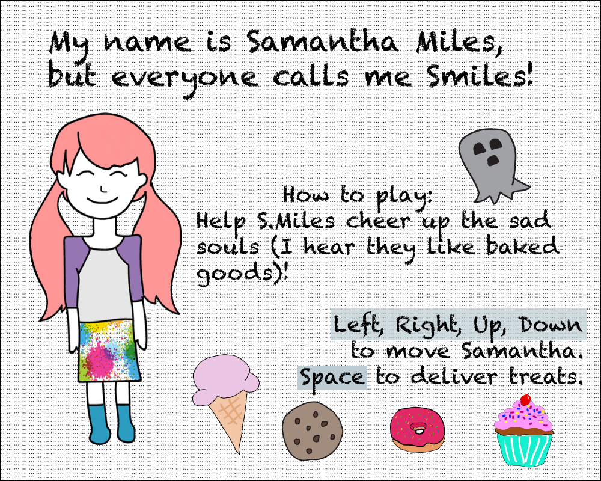
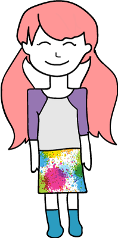
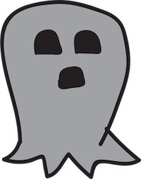
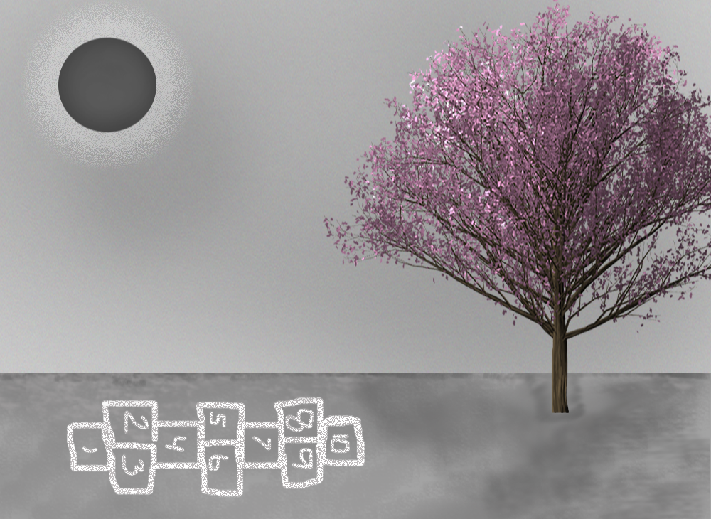
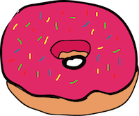
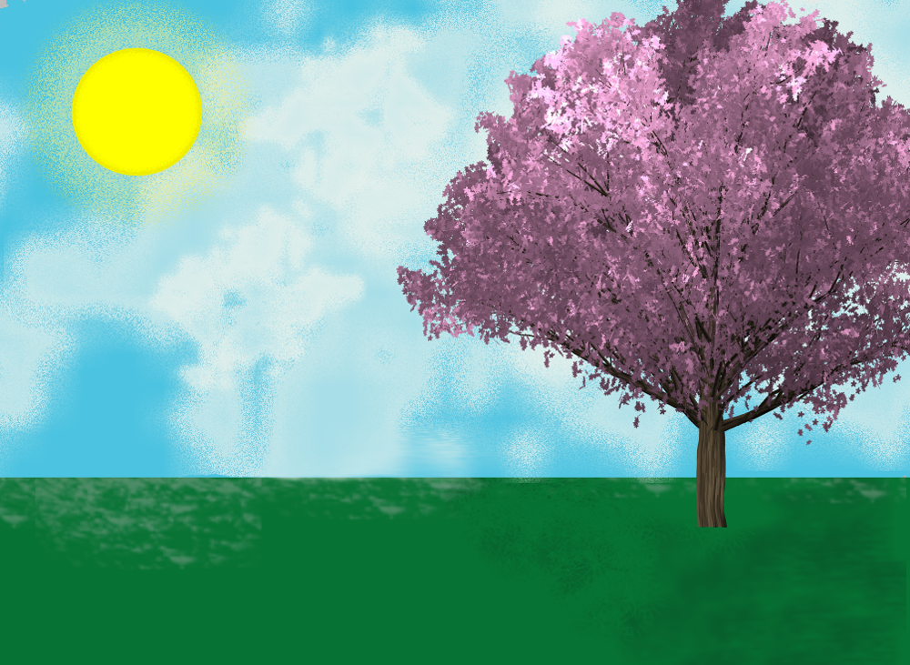
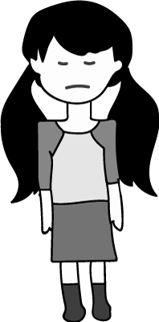

## Overview:

S.Miles is a bijou Pygame created in the first weeks of a 16 week, full-stack development course at DigitalCrafts in Atlanta.  
In this vignette we meet Samantha Miles. Her journey is unclear, her destination is undefined, but her motivation is unrelenting. During her passage, _Smiles_, as she is known to her friends, is confronted by many strangers. Smiles accepts the task of helping those she meets and these strangers soon become friends. Smiles's actions, however selfless they appear, result in dangerous consequences and ultimately our hero Smiles must confess to her greatest fear -- her own limitations. 

## Github Link:
[S.Miles](https://github.com/ValerieThoma/S.Miles)

## Technologies used:
* Python 
* Pygame

## Code snippets:

## Screenshots:

### Start Screen, Hero, Strangers and Background

	Start Screen

---------------------------------------------------
	Hero

---------------------------------------------------
	Strangers

---------------------------------------------------
	Background

### Bullets 
### Smiles prefers conflict resolution. Here our some of her methods

	Cupcake

---------------------------------------------------
	Doughnut

---------------------------------------------------
	Cookie

---------------------------------------------------
	Icecream

### Denouement

	Happy Strangers

---------------------------------------------------
	Happy Background

---------------------------------------------------
	Melancholy Hero

## Project History:

9/19/2017 - Project Start

	Project status - incomplete [See Project Difficulties] 

## Project Difficulties

The completion of this project has taken a backseat to a myriad of other projects of equal or (most often) greater importance. 
I am currently working out bugs with my monster class and researching how to implement a list for my bullet class. I have yet to add a Start and End screen and I am considering imbuing the game with a musical motif.  
I have already threatened to bug Hayes with pygame questions and he reluctantly agreed. It is likely I will ask Rob or Tamby for assistance because they are wise ninjas and I am just a mortal plebeian who has been looking at the same pygame docs for weeks to no avail.   

Lots to do. SEND COFFEE! 

