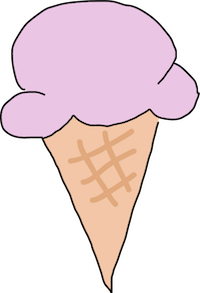

## Overview:

S.Miles is a bijou Pygame created in the first weeks of a 16 week, full-stack development course at DigitalCrafts in Atlanta.  
In this vignette we meet Samantha Miles. Her journey is unclear, her destination is undefined, but her motivation is unrelenting. During her passage, _Smiles_, as she is known to her friends, is confronted by many strangers. Smiles accepts the task of helping those she meets and these strangers soon become friends. Smiles's actions, however selfless they appear, result in dangerous consequences and ultimately our hero Smiles must confess to her greatest fear -- her own limitations. 

## Github Link:
[S.Miles](https://github.com/ValerieThoma/S.Miles)

## Technologies used:
* Python 
* Pygame

## Game Play

`python3 -m pip install pygame`

`python3 smiles.py`

## Screenshots:

### Start Screen, Hero, Strangers and Background

	Start Screen

---------------------------------------------------
	Hero

---------------------------------------------------
	Strangers

---------------------------------------------------
	Background

### Bullets 
### Smiles prefers conflict resolution. Here are some of her methods

	Cupcake

---------------------------------------------------
	Doughnut

---------------------------------------------------
	Cookie

---------------------------------------------------
	Icecream

### Denouement

	Happy Strangers

---------------------------------------------------
	Happy Background

---------------------------------------------------
	Melancholy Hero

 

